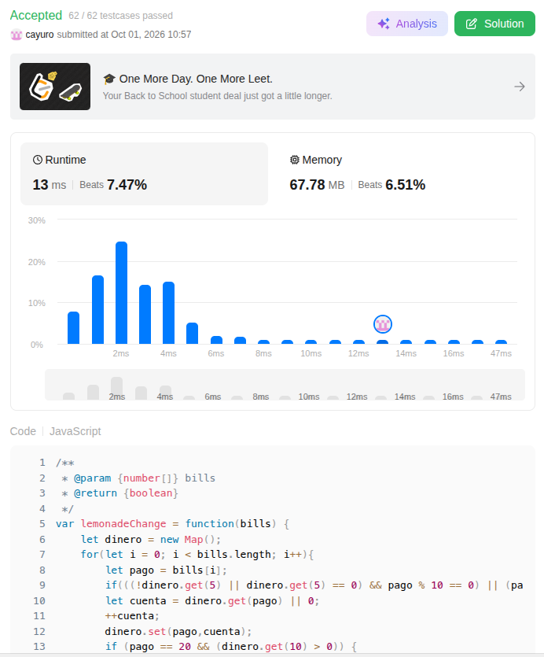
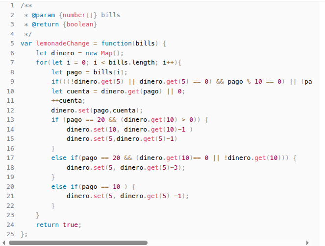
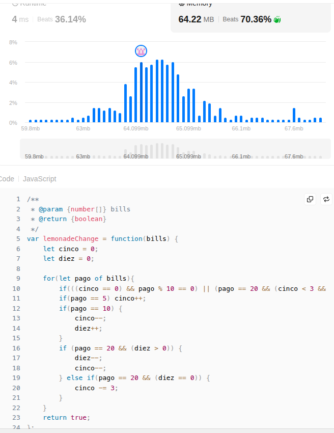
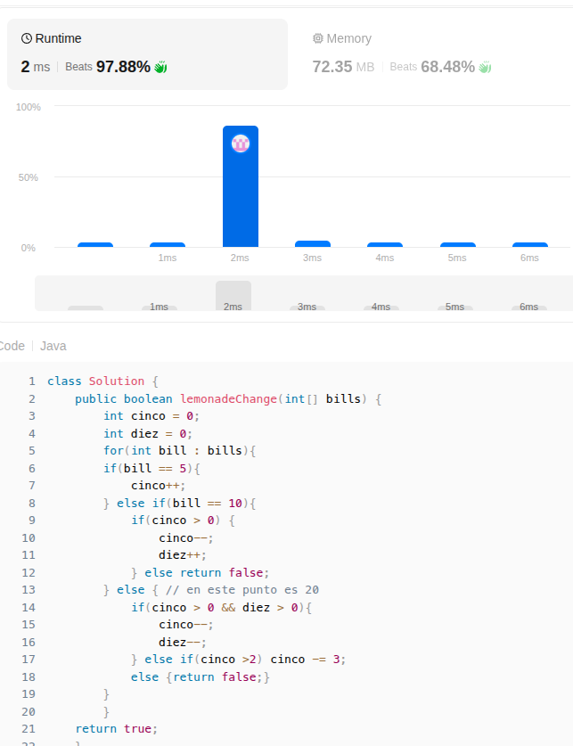
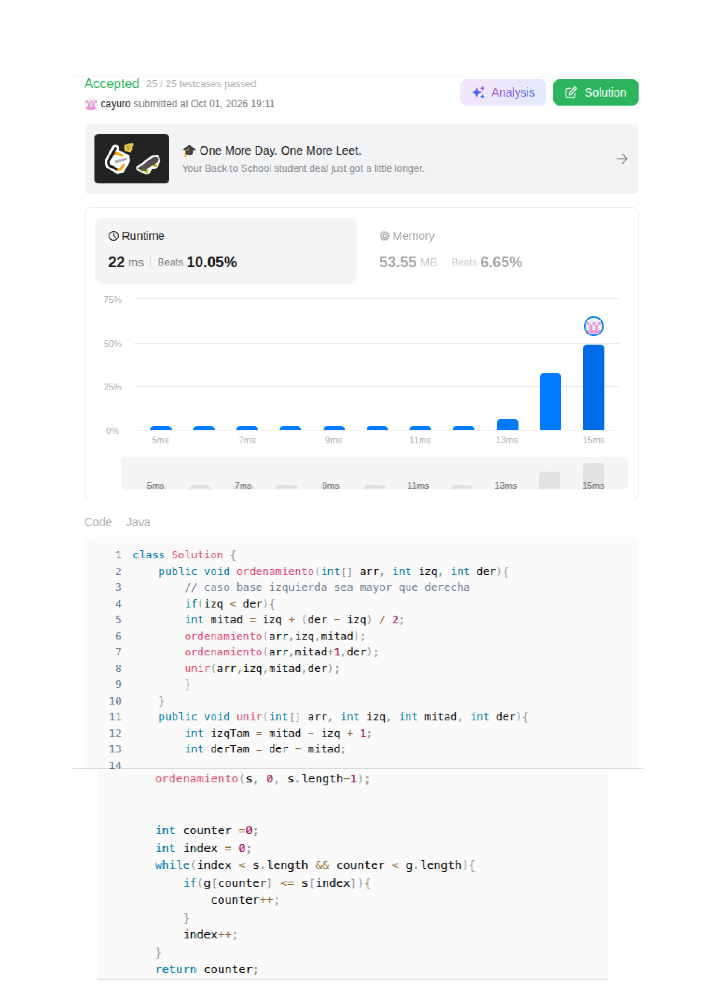
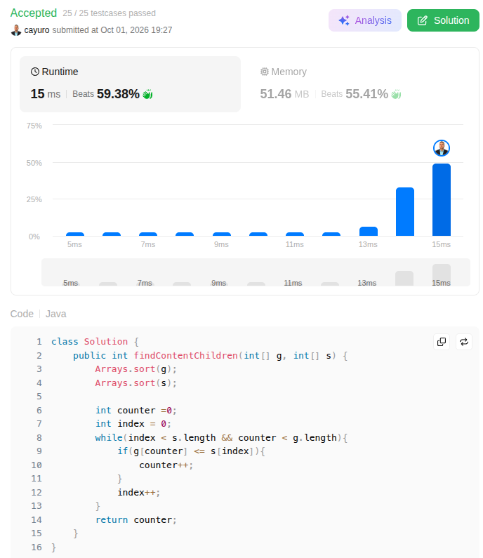

# GREEDY explicaciones
## lemonade change
### solución con map de javascript
Aquí lo que se buscaba hacer era devolver a cada uno de los usuarios la cantidad que le correpsonde entregando siempre que fuera posible y necesario billetes más grandes y luego disminuyendo 

en este algoritmo se puede ver que se va a ir restando el valor de cada billete que se entrega y se va a ir sumando el valor de cada billete que se recibe, para esto hago un mapa en donde agrego cada billete que se recibe y luego hago la logica de restar los billetes que tocaría entregar, lo primero es cuando no hay cambio para evitar hacer operaciones si sé que no habrá cambio.

aquí no es muy optimo pero funciona, el problema es que se está almacenando en un map y pues almaceno incluso los de 20, luego al pensarlo mejor entiendo que realmente no se requiere almacenar sino solamente dos valores. y ahí es cuando aplico optimización continuando como greedy, basicamente ahora lo que hago es almacenar en una variable la cantidad de billetes de 5 y de diez que hay en tontal ahí es cuando entra:

### javascript solución con varialbes

en este simplemente uso variables y dentro del ciclo evaluo que billete entra, los de 5 no tengo que validar nada sino que los ingreso al sistema, los de 10 o 20 tengo que verificar que hayan billetes de 5 para devolver, entocnes los de 10 si tengo de 5, resto 1 a la variable que me guarda la cantidad de billetes de 5 y sumo 1 a la variable que me guarda los billetes de 10. 

cuando entran los de 20 toca priorizar dar los billetes de 10, por eso el primer cambio posible es 10 y 5 y si no hay tocaría dar 3 billetes de 5, y ya si no hay simplemente sería al final falso.

el algoritmo es greedy porque siempre se busca dar el cambio con los billetes más grandes posibles, y si no hay, se da con los más pequeños y después de esto trato de optimizar haciendolo con java que es el lenguaje que más manejo, aunque sigue siendo muy similar la lógica.

### JAVA VERSIÓN - la que más optimicé

finalmente esta es la solución que más me gusta, bajo la misma lógica guardo solo billetes de 5 y de 10 que son los que me sirven para dar cambio, hago un for each para que me devuelva directamente el elemento, ese bill podría interpretarse como el pago que hace la persona y que está almacenado en los pagos o facturas bills, lo primero si es 5 entonces aumento la variable de 5, si es 10 entonces verifico que haya billetes de 5 para dar cambio y si es 20 primero verifico que haya billetes de 10 y de 5 para dar el cambio, si no hay entonces verifico que haya al menos 3 billetes de 5 para dar el cambio, si no hay tampoco entonces retorno falso.

en caso de que en ningun momento se haya retornado falso, así como en todos los otros, sale del ciclo aquí es donde sabemos que se cumplio que a todos se les dió cambio y por ende devolvemos true.

## ASSIGN COOKIES

### JAVA Solución haciendo el merge sort y luego comparando

en este primer ejercicio traté de hacer el ordenamiento que fuese más optimo para el presente caso, si bien el Arrays.sort que es el metodo que ya trae java está demasiado optimizado quería hacer de manera personal el ordenamiento para practicar también algoritmos de ordenamiento practicos como lo es el mergesort al ser estable O(nlogn) se me hace el más optimo de los que puedo hacer, es por esto que consideré que para este tipo de problemas el merge puede ser muy optimo por ser más estable aunque aumente el tiempo de ejecución en comparación con Arrays.sort. basicamente esta forma de ordenamiento lo que hace es que divide recursivamente el arreglo para luego cuando llega a arreglos de 1 un arreglo de un elemento siempre está ordenado ahí es cuando se empiezan comparar ya con otros arreglos y haciendo ordenamiento mientras se mezclan.
Finalmente la parte importante que es la de el algoritmo greedy, se utilizan dos punteros que vendrían siendo el contador que me recorre los niños y por ende sé cuantos niños están contentos, y el index que me recorre las galletas para buscar una opción válida de galleta o que satisfaga al niño, i++ entonces representa que pasamos a una galleta mas grande, o sea la siguiente galleta y como están ordenadas ya es más grande entonces va a satisfacer, basicamente gastamos las galletas en orden también con los niños en orden, si la galleta no satisface entonces pasamos a la siguiente sin aumentar el contador de niños contentos y sin ir al siguiente niño, sino que basicamente esas galletas pequeñas ya no satisfacen a nadie entonces se buscan unas un poco más grandes que satisfagan por eso el i++, y pues siempre i++ por que aunque si ya se satisfizo un niño con la galleta entonces ya esa galleta se entrego, por eso la lógica, no repito tampoco punteros pues si bien podría tener un puntero y un counter, el counter me hace las veces de puntero con los niños.

 basicamente aquí hago lo mismo pero como el Arrays.sort() ya está optimizado y es más rápido que el merge sort que hice, pues lo uso para optimizar el tiempo de ejecución, pero la lógica sigue siendo la misma, solo que ahora no hago el ordenamiento manualmente sino que lo hago con el método de java, así también pues no guardo directamente arreglos de niños y galletas divididos de forma recursiva sino que el Arrays.sort() hace el trabajo y hace que baje por lo mismo tiempo por optimización y espacio por temas también de que se maneja diferente 